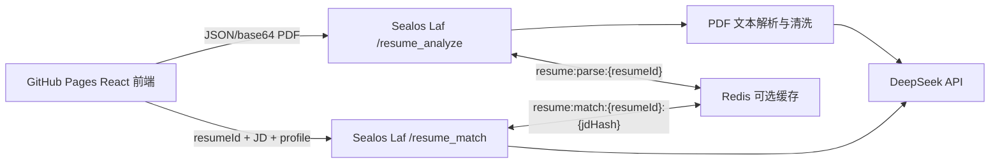

# GaliLeo CV

AI 赋能的智能简历分析系统。项目面向招聘场景，支持上传 PDF 简历、提取候选人关键信息，并结合岗位描述输出匹配评分、命中关键词、缺失关键词和 AI 评语。

## 功能概览

- PDF 简历上传：前端将 PDF 转为 base64 JSON 提交，避免跨域 multipart 上传兼容问题。
- 文本提取与清洗：后端使用 `pdf-parse` 解析 PDF，清理空字符、多余空格、页码噪声，并保留合理段落边界；同时保留一个轻量 PDF 文本兜底解析器。
- 关键信息提取：DeepSeek 负责抽取姓名、电话、邮箱、地址、求职意向、期望薪资、工作年限、技能、项目经历、学历背景。
- 岗位匹配评分：根据结构化简历和岗位描述计算匹配度，返回命中关键词、缺失关键词和中文总结。
- Redis 缓存：配置 `REDIS_URL` 后，对简历解析和岗位评分结果做缓存，避免重复调用 AI。
- GitHub Pages 部署：前端通过 GitHub Actions 发布到 GitHub Pages。
- Sealos Laf 后端：后端接口运行在 Laf 云函数上，提供 RESTful API。

## 技术选型

| 层级 | 技术 |
| --- | --- |
| 前端 | Vite, React, TypeScript |
| 部署 | GitHub Pages, GitHub Actions |
| 后端 | Sealos Laf Serverless Cloud Functions |
| PDF 解析 | pdf-parse |
| AI 模型 | DeepSeek 官方 Chat Completions API |
| 缓存 | Redis, ioredis |
| 测试 | Vitest, Testing Library, oxlint |

## 项目结构

```text
.
├── .github/workflows/pages.yml     # GitHub Pages 自动部署
├── frontend/                       # Vite React 前端
│   ├── src/App.tsx                 # 页面和交互
│   └── src/api.ts                  # Laf API client
├── functions/                      # Laf 云函数
│   ├── health.ts                   # 健康检查
│   ├── resume_analyze.ts           # PDF 解析与简历结构化
│   ├── resume_match.ts             # 岗位匹配评分
│   ├── resume_core.ts              # 本地可测的核心 helper
│   └── resume_core.test.ts         # 后端核心单测
├── laf.yaml                        # Laf 应用依赖声明
├── package.json                    # Laf 函数依赖和测试脚本
└── README.md
```

## 系统架构



## 接口说明

后端域名：

```text
https://w8m6b6odq5.sealosbja.site
```

### GET /health

```json
{
  "ok": true,
  "service": "galileo-cv-api",
  "version": "0.1.0"
}
```

### POST /resume_analyze

请求体：

```json
{
  "fileName": "resume.pdf",
  "mimeType": "application/pdf",
  "contentBase64": "JVBERi0x..."
}
```

返回：

```json
{
  "ok": true,
  "resumeId": "sha256",
  "cache": {
    "enabled": true,
    "hit": false,
    "key": "resume:parse:sha256"
  },
  "profile": {
    "name": "张三",
    "phone": "13800000000",
    "email": "zhangsan@example.com",
    "address": "上海",
    "targetRole": "Python 后端工程师",
    "expectedSalary": "25k-35k",
    "yearsOfExperience": 5,
    "skills": ["Python", "Redis", "Serverless"],
    "projects": [],
    "education": []
  }
}
```

### POST /resume_match

请求体：

```json
{
  "resumeId": "sha256",
  "jobDescription": "招聘 Python 后端开发，熟悉 Redis 和 Serverless。",
  "profile": {
    "name": "张三",
    "skills": ["Python", "Redis", "Serverless"]
  }
}
```

返回：

```json
{
  "ok": true,
  "resumeId": "sha256",
  "score": 92,
  "matchedKeywords": ["Python", "Redis", "Serverless"],
  "missingKeywords": [],
  "summary": "候选人技能与岗位要求高度匹配。",
  "cache": {
    "enabled": true,
    "hit": false,
    "key": "resume:match:sha256:jdHash"
  }
}
```

## 缓存规则

Redis 是可选增强项。未配置 `REDIS_URL` 时，接口照常工作，只是不会缓存 AI 结果。

| 类型 | Key | Value |
| --- | --- | --- |
| 简历解析 | `resume:parse:{resumeId}` | `{ profile, resumeText }` |
| 岗位匹配 | `resume:match:{resumeId}:{jdHash}` | `{ score, matchedKeywords, missingKeywords, summary }` |

默认缓存时间为 86400 秒，可通过 `REDIS_TTL_SECONDS` 修改。

## 环境变量

Laf 后端环境变量：

```bash
DEEPSEEK_API_KEY=
DEEPSEEK_BASE_URL=https://api.deepseek.com
DEEPSEEK_MODEL=deepseek-v4-flash
REDIS_URL=
REDIS_TTL_SECONDS=86400
ALLOWED_ORIGIN=https://departurezsh.github.io
```

前端环境变量：

```bash
VITE_API_BASE_URL=https://w8m6b6odq5.sealosbja.site
```

`VITE_API_BASE_URL` 已在代码中提供默认值，本地开发不配置也可运行。

## 本地开发

安装后端测试依赖：

```bash
npm install
npm test
npm run typecheck
```

启动和测试前端：

```bash
cd frontend
npm install
npm run dev
npm test
npm run lint
npm run build
```

## Laf 部署

首次配置 Laf CLI：

```bash
npm install -g laf-cli
laf user add sealaf-bja -r https://sealaf-api.bja.sealos.run
laf user switch sealaf-bja
laf login <LAF_PAT>
laf app init w8m6b6odq5
```

推送依赖和函数：

```bash
laf dep push
laf func push health -f
laf func push resume_analyze -f
laf func push resume_match -f
```

注意：不要提交 `.app.yaml` 和 `.env`，它们包含本地 Laf token、环境变量或存储凭据。

## GitHub Pages 部署

前端由 `.github/workflows/pages.yml` 自动构建并发布 `frontend/dist`。

仓库需要在 `Settings -> Pages` 中设置 Source 为 **GitHub Actions**。如果工作流提示 `Get Pages site failed`，先在 GitHub 设置页启用 Pages，或配置具有 Pages 权限的 `PAGES_TOKEN`。

线上地址：

```text
https://departurezsh.github.io/GaliLeo_CV/
```

## 常见错误

| 错误码 | 说明 |
| --- | --- |
| `INVALID_FILE` | 未上传 PDF 或文件内容为空 |
| `PDF_PARSE_FAILED` | PDF 无法提取文本，可能是扫描件或加密文件 |
| `DEEPSEEK_NOT_CONFIGURED` | Laf 未配置 `DEEPSEEK_API_KEY` |
| `DEEPSEEK_REQUEST_FAILED` | DeepSeek API 请求失败 |
| `PROFILE_REQUIRED` | 未传 `profile`，且 Redis/内存中没有对应解析结果 |
